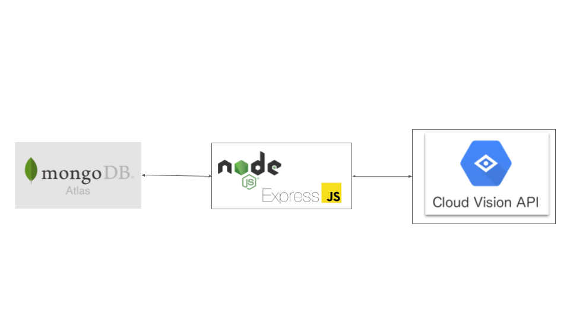

# Shopiy Fall 2021 Internship Developer Challenge

[Link to the challenge](https://docs.google.com/document/d/1ZKRywXQLZWOqVOHC4JkF3LqdpO3Llpfk_CkZPR8bjak/edit#)

## About

This repository has the builds Image Repostory API that allows you to upload images with other metadata as well as allowing Google Cloud Vision API to produce more metadata tags about the image. The repostoiry as allows you to perform a full text search.

## Technologies Used

- [Node.js](https://nodejs.org/en/)
  - [Mongoose](https://mongoosejs.com/docs/)
  - [multer](https://github.com/expressjs/multer)
  - [Express.js](https://expressjs.com/)
- [MongoDB](https://www.mongodb.com/) (via [MongoDB Atlas](https://www.mongodb.com/cloud/atlas))
- [Google Cloud Vision API](https://cloud.google.com/vision)

## Setup

Install Node.js and yarn.

Make a copy of `.env.example` and name it `.env`

Get a MongoDB Atlas cluster setup, and then copy the connect url (with admin and password in the url) and paste it as value of `MONGODB_URL` in the `.env` file.

Make a Google Cloud project with Vision API access, create a service account and place the `json` service account into the root of the project. Copy and paste the path to the service account json file as the `GOOGLE_APPLICATION_CREDENTIALS` variable in `env`.

Then install dependencies

```
yarn
```

and then start the server

```
yarn start
```

# Visualized Architecture


